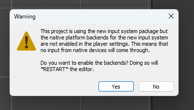

# READ ME BEFORE ANYTHING

Hi guys good luck with ur deving lol

**Unity version must be 6000.3.0f1 or the whole thing will be cooked**

Also uhh when you start the project if you see this warning:

  

**PRESS *NO* OR YOU WILL BE COOKED**

Aside from that when you try to run the game run it from the level or safeArea scene because the main menu is cooked

if you want to pattern that, be my guest!!

I think that's all, there are comments in the different scripts that explain them briefly but glhf!! 🥳

## Jaleel

Didn't wanna delete any of Eman's part so I'm just adding mine below

To summarise, this game is made INCREDIBLY stupid, not utilising one of unity's best features. My main pet peeve, the maps.
They are generated from txt files and assets are loaded over them (by me). Even worse cuz the levelManager code needs
9 files to load in fully and form a 3x3 grid (rommMaps 0-8).

Also, that warning in Eman's part should be fixed and the warning shouldn't come up, but if it does just click no.
If it does then you also won't have the right input manager setup so you will need to go to here:
- Edit -> Project Settings -> Player -> Active Input Handling and set it to Both
If you don't do this the main menu won't work.

Final note, there's a lot I didn't explain intentionally cuz screw you, go through my pain and figure it out urself.
Feel free to change whatever you want, even assets cuz i lowkey just grabbed generic ass ones while making it.
Also, add hentai, you know you want to.

Oh yeah, the game is runnable from the main menu, I made it. Feel free to make it *worse*.

## Ola

Okay sooooo, so basically to play the game **REDACTED**. If you accidentally
enter the boss room before doing this icl youre just cooked. Also sometimes key spawns in walls and stuff idk what Jaleel did there. Anyways ummm have fun with the boss battles i created, feel free to add more. **REDACTED** so if someone wants to do that feel free, add as much **REDACTED** as possible. Also hit detection is kinda ass, **REDACTED** doesnt work yet although
I did start to implement it, audio cuts in at random times sometimes and uhhhhh idk there are some other things i messed up but you guys got !!

This was my first time coding in C sharp so everyone hop off my dick btw anyways enjoy.

## Andrew 

Lmao good luck gng
